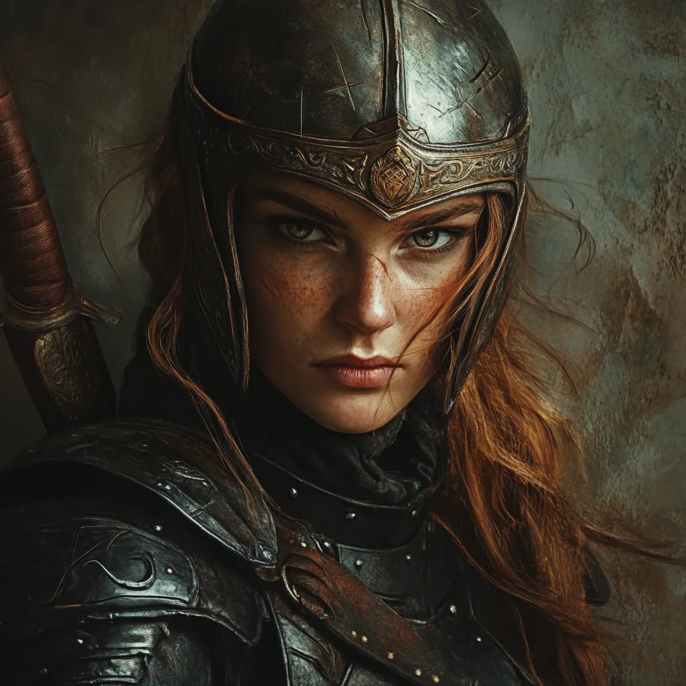
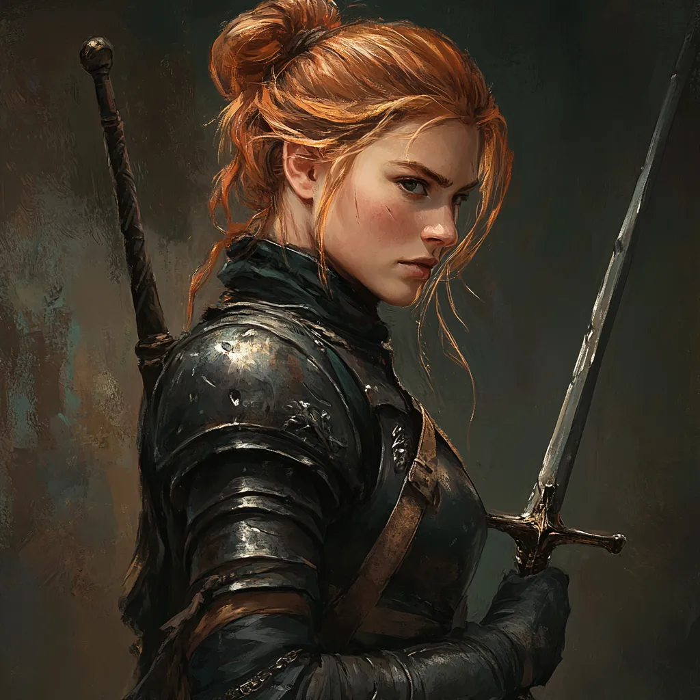
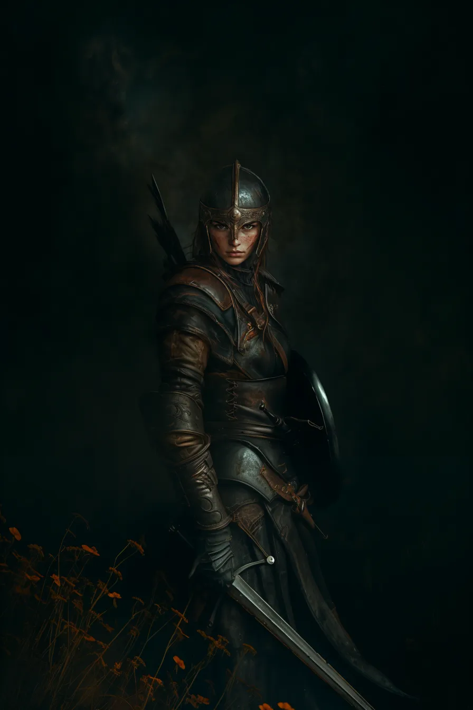
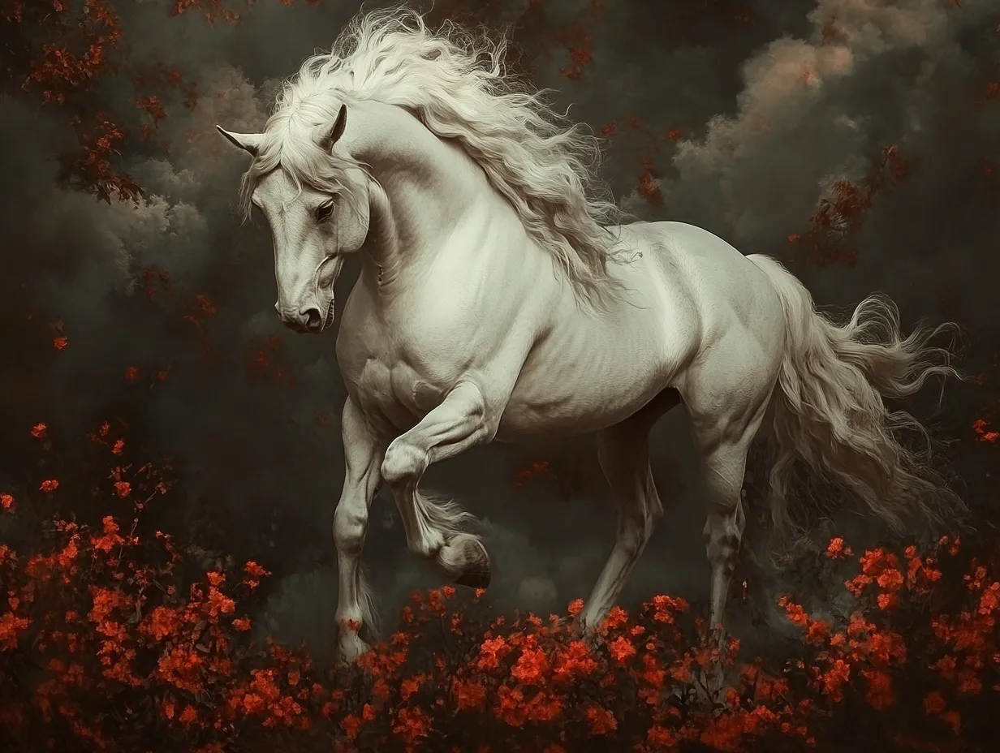

# Celenneth

*Appendix: Characters*

Celenneth was born and raised in the North. Her father died when she was an infant, and her mother was killed and her sister captured when she was nine.

She was later taken two adult men, rangers of the North, Brandor and Orlec. They raised Celenneth in the ways of the Dúnedain and as a ranger; a hard life, but one that she thrived in. By age fourteen she was independent and seen as a peer, and began working as a messenger, her feet swift.

### Nimroch, her horse from Elrond

