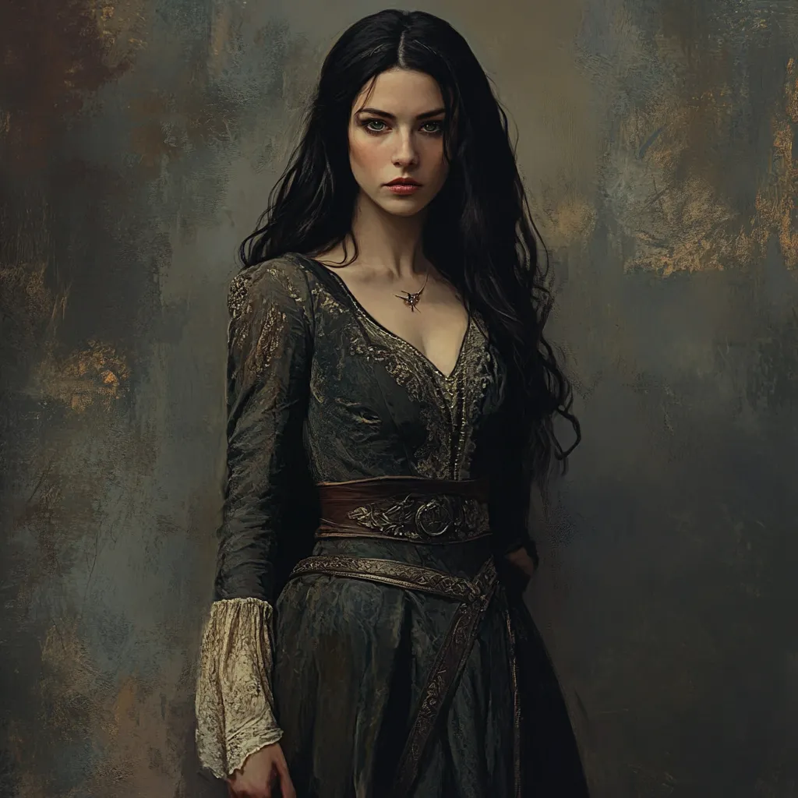
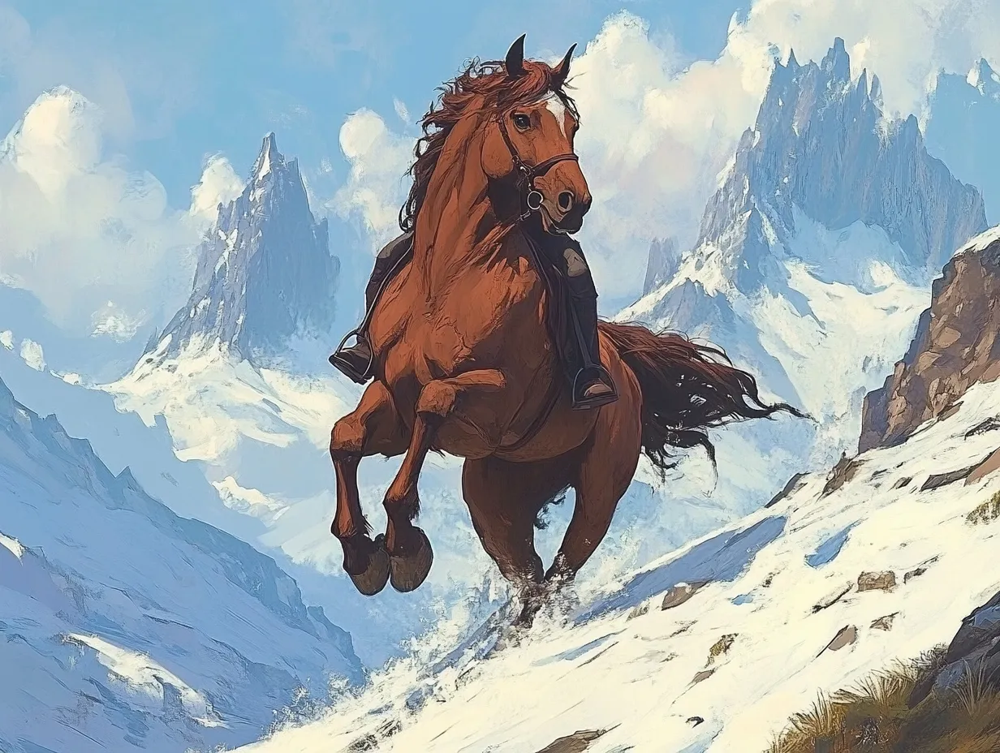

# Linnea

*Appendix: Characters*

A few years younger than Celenneth, Linnea was born and raised in Bree but traveled often with her father and mother, who were merchants. Her mother died from illness when Linnea was 13, and she took over the aspects of the business that her mother had taken on. When traveling east of Bree towards the Misty Mountains, they were attacked by bandits and her father was killed and Linnea was captured. As luck would have it, Celenneth found her and rescued her.

She began to learn herbalism from Eorlas, and archery from Celenneth, and later learned horsemanship in the Rohan style from Eadwyn. Radagast prophesied that she would work with Celenneth in the dangers to come. At Yule, she and Celenneth took the binding of aegis, an oath of commitment to one another.

### Eorlin, her horse from Rohan

