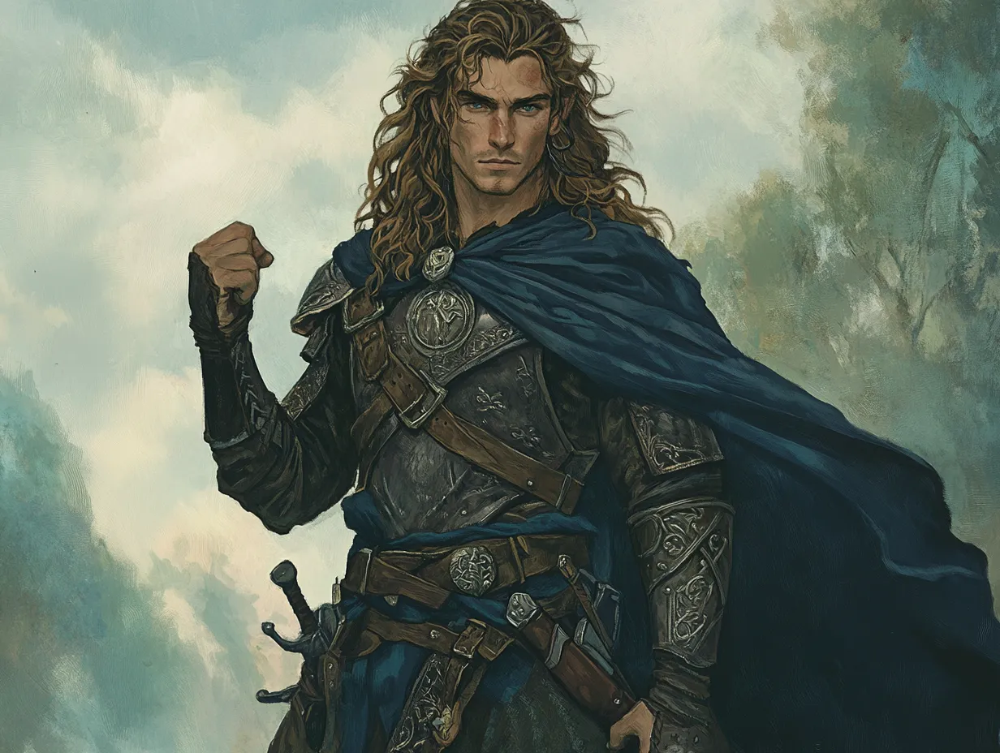

# Hallas

*Appendix: Characters*

Hallas, at 31 years of age, is the embodiment of boldness and strength among the Rangers of the North. His tall, commanding frame and long, flowing hair give him a striking presence, as if he were a hero plucked from an ancient ballad. Unlike Damrod, Hallas does not shy away from attention; he thrives in moments of action and challenge, his confidence exuding from every step. His energy is infectious, inspiring those around him to face danger head-on. Hallas’s skill with the spear and his keen instincts in battle make him a formidable warrior, but his strength goes beyond the physical. He carries a fiery determination that drives him to push boundaries and achieve the seemingly impossible.

Despite his boldness, Hallas is not reckless. He understands the weight of his actions and their consequences, even if he sometimes struggles to temper his impulsive nature. His drive to protect and lead stems from a deep sense of justice and a belief that strength should serve the weak. Hallas’s charisma is magnetic, drawing people to him whether in battle or over a campfire. However, his confidence can sometimes mask his inner doubts—he wonders if his drive to lead comes from true purpose or a need to prove himself worthy of the lineage of the Rangers. Nevertheless, Hallas is a beacon of hope and courage, someone who stands tall against the darkness and reminds others of the strength that lies within.
