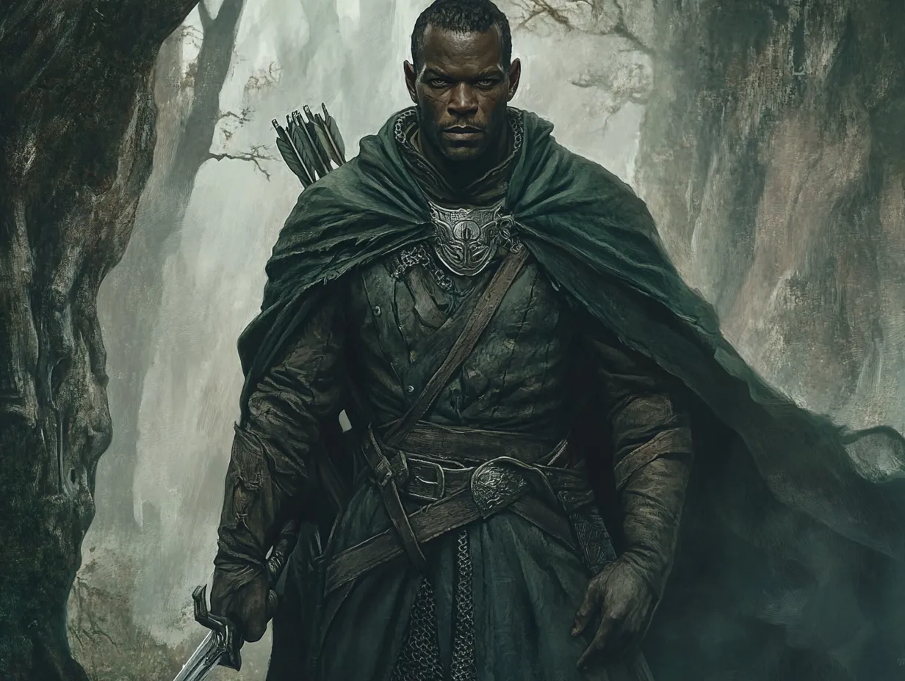

# Damrod

*Appendix: Characters*

Damrod is a man of quiet resolve and unshakable duty, embodying the stoic traditions of the Rangers of the North. At 37 years of age, his features are rugged, marked by years spent patrolling the wilds and weathering both physical and emotional storms. His eyes are sharp and observant, always scanning for danger, and his movements are deliberate, like a predator that knows when to conserve its energy. He prefers the shadows to the limelight, choosing subtlety and strategy over bold displays of power. His subtlety often makes him seem distant, but those who know him recognize the depth of his honor and commitment. Damrod is a protector to his core, driven by an unwavering belief in preserving the safety and sanctity of the lands he watches over, even if it comes at great personal cost.

Though his demeanor can seem cold, Damrod carries a quiet wisdom and compassion that reveal themselves in the most critical moments. He is a calming presence in chaos, his decisions grounded in logic and experience. As a Warden, he sees himself as a guide and shield, whether for his fellow Rangers or those who find themselves caught in the dangers of the wild. His respect for tradition and his ability to endure hardship make him a cornerstone of any endeavor. However, this same sense of duty often isolates him, as he struggles to prioritize his own desires over the mission at hand. For Damrod, the journey is never about personal glory but about ensuring the survival of what is good and just.
