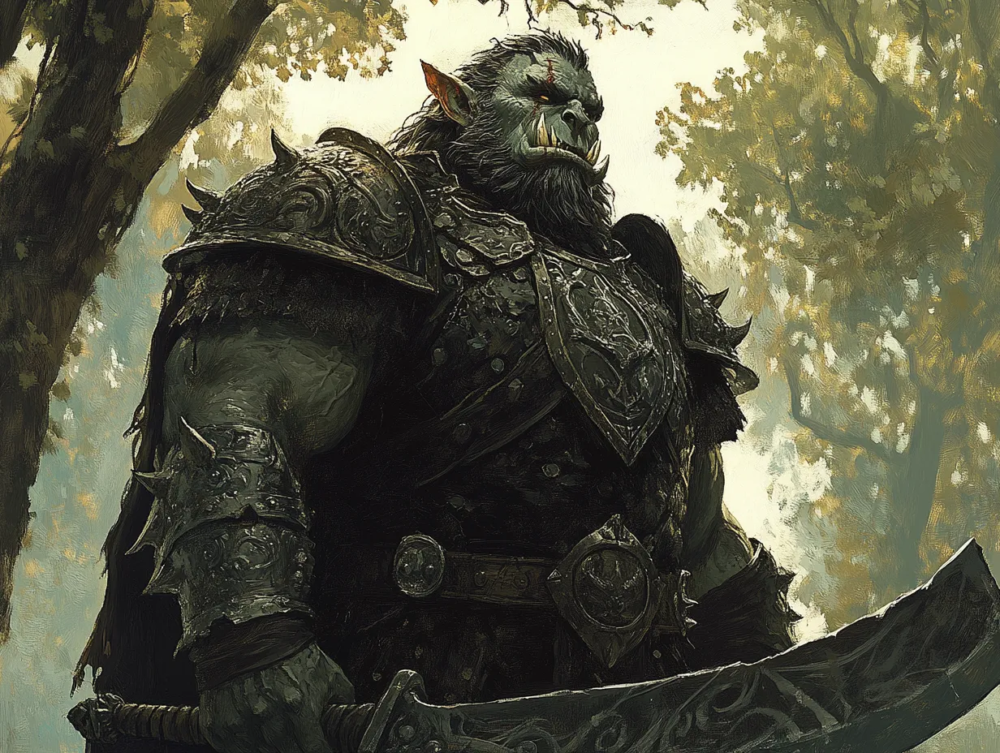

# The Orcs

*Appendix: Characters*

### Grusk Ironfang (The Leader)

- **Role and Personality:** Grusk is the clear leader of the band, a hulking brute with a grim cunning. His voice is a rasping growl, and he speaks in both guttural Black Speech and broken Westron when issuing commands. Grusk takes pride in his role, seeing Celenneth as a valuable trophy to present to Dol Guldur. He’s disciplined compared to the others, tolerating no disobedience, but his pride borders on arrogance.

- **Distinguishing Features:** Grusk’s lower jaw is reinforced with crude iron plates bolted into his flesh, giving his face a monstrous, unnatural appearance. He wields a jagged, two-handed cleaver, which he calls "Bite-Blood."

- **Relationship to Celenneth:** He sees her as a prize, someone who can bolster his status if delivered intact to the Shadow’s agents. He’s fascinated by her resilience, though he masks it with mockery.

### Snaga Goretongue (The Coward)

- **Role and Personality:** Snaga is the smallest of the group, with a wiry frame and a penchant for scavenging. His role seems to be more of a camp servant, but he compensates for his lower standing with venomous wit and a tendency to sow discord. He enjoys tormenting Celenneth verbally, mocking her weakness but staying far from her reach.

- **Distinguishing Features:** His face is heavily scarred, and his right eye is milky white. He carries a mismatched collection of knives and daggers, which he claims are from his kills.

- **Relationship to Celenneth:** Snaga views her with a mix of jealousy and spite. He’d rather leave her behind than risk trouble, but he won’t openly challenge Grusk’s orders.

### Uglat Stonearm (The Executioner)

- **Role and Personality:** Uglat is Grusk’s enforcer, a brutal figure who thrives on violence. He is the loudest voice advocating for Celenneth’s death, arguing that she’s too much trouble to keep alive. Uglat respects strength above all and is annoyed by Grusk’s fixation on taking her to Dol Guldur. He’s short-tempered and impulsive, prone to outbursts if challenged.

- **Distinguishing Features:** Uglat’s left arm is encased in a crude, stony prosthetic, a “gift” from a failed raid on Gondor. The arm is fitted with spiked plates, which he uses as a weapon.

- **Relationship to Celenneth:** He sees her as a liability and would relish killing her himself, believing that leaving her corpse behind would be a statement of strength.

### Zograt Spinebreaker (The Silent One)

- **Role and Personality:** Zograt is a shadowy figure who speaks rarely, his actions more menacing than his words. He is fiercely loyal to Grusk but harbors his own ambitions. When Zograt does speak, his words are quiet and measured, hinting at intelligence and cruelty.

- **Distinguishing Features:** He wears a necklace made of vertebrae, and his weapon of choice is a weighted chain he swings with terrifying precision.

- **Relationship to Celenneth:** Zograt sees her as a curiosity and a puzzle. Though he doesn’t care whether she lives or dies, he studies her closely, making her uneasy under his silent scrutiny.

### Rukha Blacktooth (The Pragmatist)

- **Role and Personality:** Rukha is the second loudest voice arguing to kill Celenneth, but his reasons are pragmatic rather than bloodthirsty. He sees her as a burden, someone who slows their march and increases their risk of discovery. Rukha is a survivalist, with little interest in glory or trophies.

- **Distinguishing Features:** His teeth are blackened from some vile concoction he consumes for strength. He wields a short axe and keeps a satchel of strange powders and salves.

- **Relationship to Celenneth:** He views her as dead weight but is less hostile than Uglat. If she were useful to their survival, he might argue to spare her.

### Morga Ironlash (The Interrogator)

- **Role and Personality:** Morga takes a grim delight in pain and intimidation, often using his spiked whip to discipline prisoners—or his own comrades. He sides with Grusk, eager to bring Celenneth back to Dol Guldur, if only to witness her torment. He speaks Westron better than most, which makes him particularly dangerous.

- **Distinguishing Features:** Morga carries a vicious barbed whip, his favored weapon, which he cracks with unnerving precision. His armor is piecemeal, decorated with the bones of his victims.

- **Relationship to Celenneth:** Morga takes every opportunity to frighten her, enjoying her discomfort and fear. He’s the most dangerous in close quarters, reveling in others’ pain.
